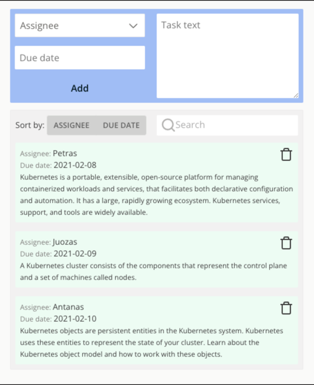

# Task 1

### Anagram solver
Write a function which checks if given two strings are an anagram. 
An anagram is a string formed by rearranging the characters of a different string.  
EXAMPLE:
- abcd cbda - true
- hello hello - true
- aaaba abaaa - true
- qwerty qwertyy - false
- abcd cbaa - false

# Task 2
### TODO app

Write a todo app using react and typescript. 
No requirements for other libraries - use whatever you want.

REQUIREMENTS:

- Form with assignee (dropdown), due date (datepicker) and description (text area)
- Display todos
- User must be able to delete a todo
- Todos should be sortable by assignee or due date
- Todos should be searchable (all properties are included in search)

